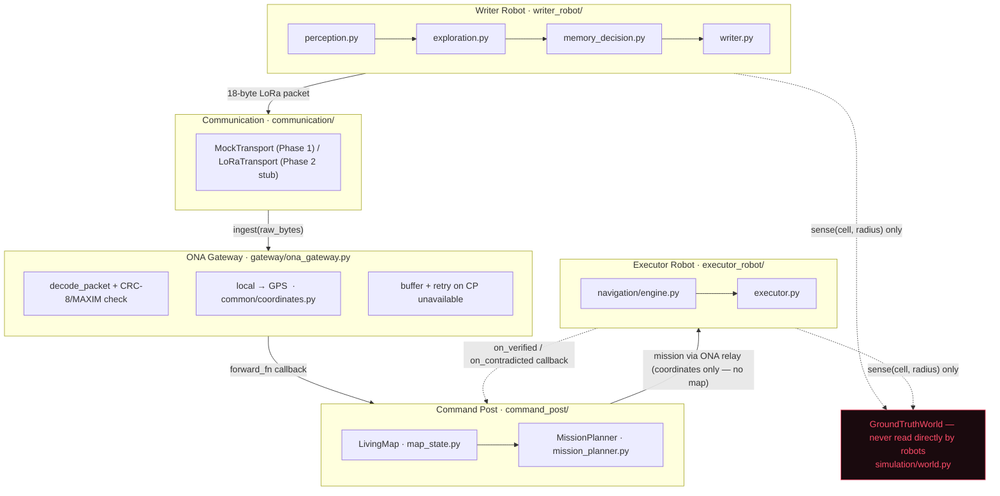
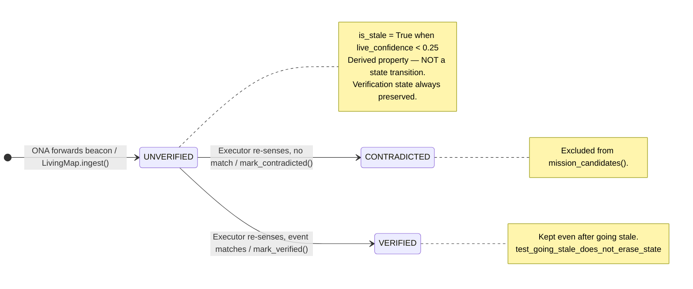
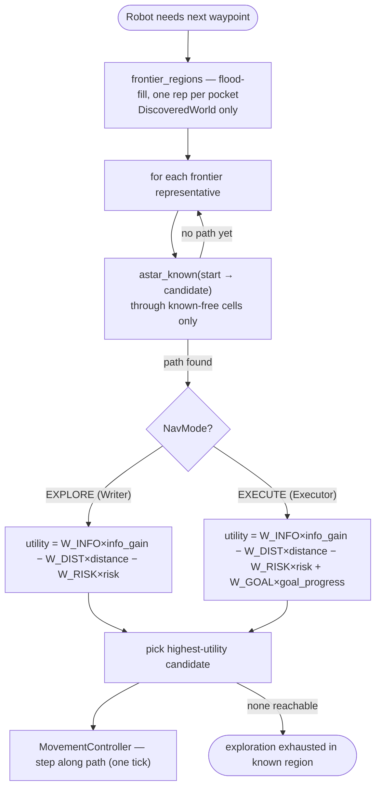
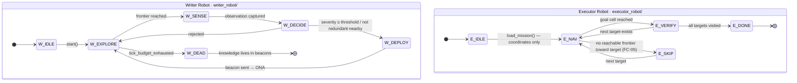
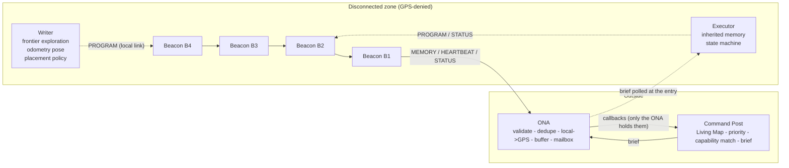

# THE LIVING MAP — System Architecture (Phase 1)

TSYP14 IEEE RAS × AESS Tunisia 

Status key used throughout this document and the codebase:
**[IMPLEMENTED]** working code, covered by tests · **[SIMULATED]** modelled
in software, not yet physically validated · **[PLANNED]** designed but not
built yet · **[ASSUMPTION]** a value or behaviour chosen without field
data.

## 1. What changed from the first prototype

The first prototype (still visible in git history) had two problems this
version fixes directly:

1. **The Writer was not actually autonomous.** It read hidden event
   locations from a module-level list and walked to them in a fixed
   order. This version's Writer only ever calls
   `GroundTruthWorld.sense(cell, radius)` — see `simulation/world.py` — and
   builds its own `DiscoveredWorld`. A structural test
   (`tests/test_world.py::test_robot_code_never_touches_ground_truth_internals`)
   greps `writer_robot/` and `executor_robot/` for ground-truth internals
   and fails the build if either ever reads them directly.
2. **Duplicate, disconnected implementations.** The first prototype had a
   monolithic `simulation/system.py` that reimplemented the Writer, ONA,
   Command Post and Executor inline, sitting next to a second, nicer,
   decomposed package structure that nothing actually imported. This
   version has exactly one implementation of each actor; `simulation/
   system.py` is now genuinely thin — it wires packages together and runs
   the tick loop, nothing else.

## 2. The challenge chain, and where each piece lives

> **Updated by the Phase-1 patch.** The previous revision of this section described
> `Writer -> MockTransport -> ONA`, with executor results returned through callbacks wired in
> `simulation/system.py`. That shortcut is gone from the system: see section 6 for the real flow.
> The block diagram below is kept for the module layout; its `MockTransport` box now only serves
> single-robot unit tests.

```
Writer (writer_robot/)
  --PROGRAM frame (local link)-->  Beacon (beacon/node.py)
  --hop-by-hop, ACK/retry, TTL-->  Beacon ... Beacon          (communication/mesh.py radio)
  --MEMORY / HEARTBEAT frames--->  ONA (gateway/ona_gateway.py)   validate, GPS-translate, buffer
  --callbacks held ONLY by ONA-->  Command Post (command_post/)   Living Map, planner, fleet
  <--brief in ONA mailbox--------  Command Post
  Executor (executor_robot/) polls the ONA for its brief at the entry, enters, works,
  writes its observation into a beacon (PROGRAM) / STATUS frames, returns.
```

There is no direct Writer/Executor <-> Command Post link anywhere in the code, and this is enforced
by tests (`tests/test_architecture.py`): robot/beacon/radio packages may not import `command_post`,
the radio medium has no Command Post node, and only the ONA holds callbacks into it.




## 3. Ground truth vs. discovered map vs. Living Map

Three distinct objects, on purpose (`simulation/world.py`,
`command_post/map_state.py`):

- **`GroundTruthWorld`** — the complete arena + hidden events. Exposes
  almost nothing publicly; the only way to learn anything from it is
  `sense(cell, radius)`, a BFS-through-free-cells local visibility model.
  `all_event_ids()` / `event_by_id()` exist only for the simulator's own
  scoring/metrics — robot code must never call them (enforced by the
  structural test above).
- **`DiscoveredWorld`** — one robot's own reconstructed map (per-cell
  FREE/WALL/UNKNOWN), grown only through `integrate(sensor_snapshot)`.
  Writer and Executor each have their own; the Executor does **not**
  inherit the Writer's map, only the beacon coordinates.
- **`LivingMap`** (`command_post/map_state.py`) — the Command Post's own
  aggregate of `MemoryRecord`s, with verification state
  (`UNVERIFIED → VERIFIED / CONTRADICTED`) and confidence aging. This is
  what "the map changes as knowledge changes" actually means in code.




## 4. Shared navigation engine

`navigation/engine.py` is used by both robots, in different modes
(`common.enums.NavMode`):

- **EXPLORE** (Writer): frontier-region scoring —
  `utility = W_INFO·info_gain − W_DIST·distance − W_RISK·risk`.
- **EXECUTE** (Executor): the same scoring, plus a bonus for frontiers that
  reduce distance to a target coordinate — goal-directed frontier search,
  since the Executor does not have the tunnel layout memorised either; it
  only has a beacon's coordinates and has to discover its own route.
- **VERIFY**: handled by `executor_robot/executor.py` once the goal cell is
  reached — re-sense at that location and compare against what the
  memory record claimed.
- **RETURN**: [PLANNED], not used in the Phase 1 demo.

All weights (`W_INFO_GAIN`, `W_DISTANCE`, `W_RISK`, `W_GOAL`) are
[ASSUMPTION] — not tuned against real mission data, but centralised in one
place and easy to adjust.




## 5. Selective memory

`writer_robot/memory_decision.py` is a pure function, independently
tested, deliberately separate from movement/perception code:
`evaluate(observation, already_deployed) -> MemoryDecision`. An
observation becomes a beacon only if it clears severity/confidence
thresholds **and** isn't redundant with something already preserved
nearby (same event type within `DEDUP_RADIUS_CELLS`).

## 6. What is explicitly out of scope for Phase 1

- **Beacon PROGRAM/ACK/retry protocol** (`beacon/memory_node.py`
  implements STORE + repeatable BROADCAST only). There is no simulated
  over-the-air "programming" step yet, so a full ACK/retry state machine
  has nothing real to negotiate with — it belongs with the first real
  ESP32 beacon.
- **Baseline-vs-Living-Map benchmark** (§27 of the evolution plan).
  `simulation/metrics.py` records the data a benchmark needs; the actual
  dual-run comparison harness is [PLANNED].
- **Persistent storage / real HTTP-MQTT uplink** for the ONA and Command
  Post — currently in-memory, by design, for Phase 1.
- **Multiple Executors / capability routing** — explicitly deferred per
  the vision doc; the physical prototype stays one Writer + one Executor.

## 7. Hardware

The **ESP32-only stack** has been chosen — see `hardware/README.md` for the
full decision rationale, corrected GPIO map, power tree, and BOM. Nothing in
`common/`, `communication/`, `navigation/`, `writer_robot/`, `executor_robot/`,
`gateway/`, or `command_post/` depends on a specific board — the only
hardware-shaped seam is `communication/interface.py`'s `BaseTransport`,
which `communication/lora_transport.py` implements for the SX1278 Ra-02 LoRa
module on ESP32 SPI.

## 8. Deviations from the originally proposed file tree

A few files from the evolution plan's proposed tree were deliberately
merged rather than created as near-empty stubs (per that same plan's own
instruction: "do NOT preserve module names merely for historical
reasons... final structure should reflect actual responsibilities"):

- `gateway/frame_translation.py` and `gateway/buffering.py` → folded into
  `gateway/ona_gateway.py` (each was a handful of lines; `common/
  coordinates.py` remains the one authoritative transform).
- `beacon/state_machine.py` → folded into `beacon/memory_node.py`'s
  `BeaconState` enum (there is no PROGRAM/ACK negotiation to give a
  separate state machine module something to do yet — see §6).
- `writer_robot/navigation.py` / `executor_robot/navigation.py` → replaced
  by the single shared `navigation/engine.py`, which is the whole point of
  §7/§23 of the evolution plan ("avoid duplicate algorithms").

## 9. Robot state machines




---

## 6. Phase-1 spatial-memory network (added by the Phase-1 patch)

Status labels: **[IMPLEMENTED]** logic exists and is tested; **[SIMULATED]** the physical layer
(radio, world, sensors, drop mechanism) is a model; **[PLANNED]** not built.



| Component | Responsibility | Where | Status |
|---|---|---|---|
| Radio medium | range + wall attenuation + latency + seeded loss; no real RF | `communication/mesh.py` | SIMULATED |
| Mesh frame | link header + end-to-end header + payload + CRC-8 | `common/protocol.py` | IMPLEMENTED |
| Beacon node | versioned multi-record memory, gradient routing, ACK/retry, TTL, dedupe, store-and-forward, heartbeat | `beacon/node.py` | IMPLEMENTED (logic) / PLANNED (firmware) |
| Placement policy | event importance, hosting-beacon reuse, stock, bridge-on-demand relays | `writer_robot/placement.py` | IMPLEMENTED |
| ONA | receive, validate, translate, carry, mailbox - never plans | `gateway/ona_gateway.py` | IMPLEMENTED / SIMULATED links |
| Command Post | Living Map lifecycle, priority, executor choice, brief | `command_post/` | IMPLEMENTED |
| Executor | brief -> navigate (re-plans) -> task -> memory write -> return | `executor_robot/executor.py` | IMPLEMENTED / SIMULATED world |

Reliability concepts are kept separate on purpose: **CRC-8 only detects corruption on one hop**;
**ACK + retry + forwarding + store-and-forward** are what move data. A valid CRC says nothing about delivery.

Memory lifecycle (every transition bumps `version`; an older version never overwrites a newer one):

```
UNVERIFIED --Executor confirms--> VERIFIED --still present--> ACTIVE
                                      |--needs more action--> ESCALATED
open state --Executor: gone-------> CLEARED
open state --Executor: not there--> CONTRADICTED
staleness = derived flag from confidence decay, never a state change
```
