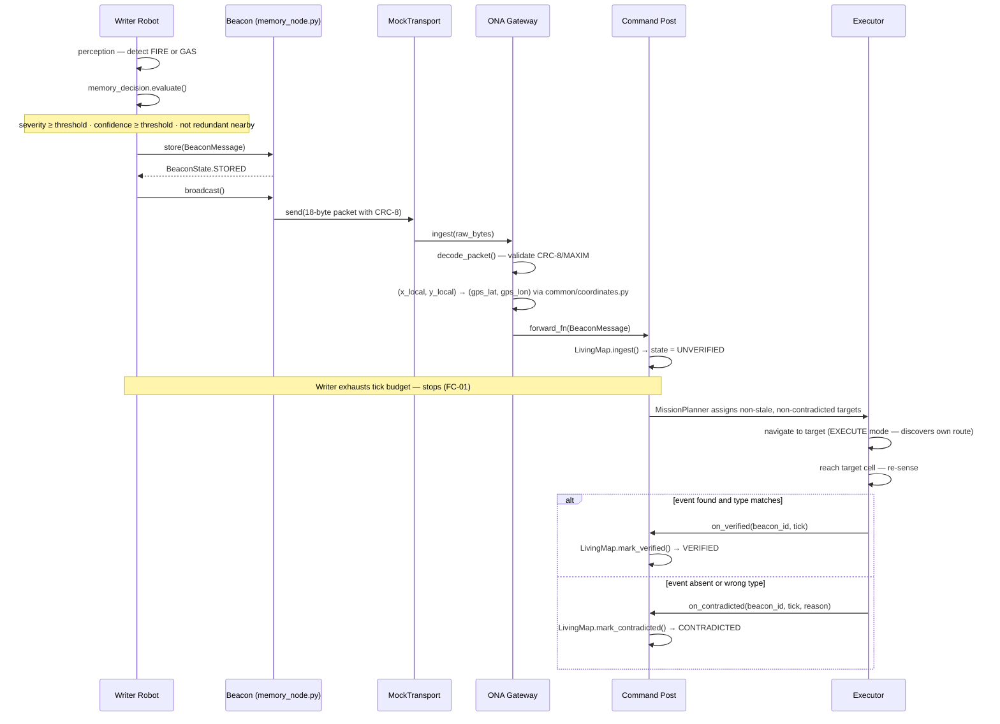

# Beacon Wire Protocol v1

Single authoritative implementation: `common/protocol.py`. Nothing else in
the codebase defines a beacon message format — `beacon/__init__.py`
re-exports from here for backward-compatible imports, and that's the only
other place `BeaconMessage` is even mentioned.

## Wire format — 18 bytes, little-endian

| Bytes | Type    | Field               | Notes |
|-------|---------|---------------------|-------|
| 0     | uint8   | `beacon_id`         | unique per deployment session |
| 1     | uint8   | `event_type_id`     | see table below |
| 2-5   | float32 | `x_local`           | metres east of zone entry |
| 6-9   | float32 | `y_local`           | metres north of zone entry |
| 10-13 | uint32  | `timestamp`         | unix seconds, deployment time |
| 14    | uint8   | `severity`          | 1 (low) .. 4 (critical) |
| 15    | uint8   | `initial_confidence`| 0-100, at deployment |
| 16    | uint8   | `battery_pct`       | 0-100 |
| 17    | uint8   | CRC-8/MAXIM         | over bytes 0-16 |

17-byte payload + 1-byte CRC = **18 bytes total**. `PACKET_SIZE` and
`PAYLOAD_SIZE` in `common/protocol.py` assert this at import time, so a
future edit that silently changes the struct format fails loudly instead
of drifting.

### Event type registry

| id | event_type       |
|----|------------------|
| 1  | VICTIM_PRESENCE  |
| 2  | FIRE             |
| 3  | GAS              |
| 4  | STRUCTURAL       |

Phase 1's default scenario only spawns FIRE and GAS (the two
challenge-required types); VICTIM_PRESENCE/STRUCTURAL exist for
extensibility and are covered by `tests/test_perception.py`, but
STRUCTURAL has no dedicated sensor mapping yet ([PLANNED]).

### Integrity

CRC-8/MAXIM (polynomial 0x31), computed over the 17-byte payload.
`decode_packet()` rejects a packet whose trailing byte doesn't match —
see `tests/test_protocol.py::test_bad_crc_rejected`.

### What is deliberately NOT in the wire packet

GPS coordinates. The ONA gateway (`gateway/ona_gateway.py`) attaches
`gps_lat`/`gps_lon` to the `BeaconMessage` object **after** decoding, via
`common/coordinates.py`'s local→GPS transform — the radio packet only ever
carries the compact local-frame `x_local`/`y_local`. Likewise, verification
state (UNVERIFIED/VERIFIED/CONTRADICTED), history, and anything
Command-Post-side lives in `common/memory.py`'s `MemoryRecord`, never on
the wire. This split — physical packet vs. logical/ONA metadata — is a
direct requirement from the project vision.

## Confidence aging

```
live_confidence(t) = (initial_confidence / 100) * e^(-DECAY_LAMBDA * age_seconds)
```

`DECAY_LAMBDA = 0.002` [ASSUMPTION, not field-calibrated]. Computed once,
in `BeaconMessage.live_confidence` (and mirrored identically in
`MemoryRecord.live_confidence` — same constants, same formula, imported
from the one place they're defined, not redefined). A record is `is_stale`
once `live_confidence < STALE_THRESHOLD` (0.25). Going stale does **not**
erase a record's verification state or history — see
`tests/test_memory.py::test_going_stale_does_not_erase_state`.

## Beacon device lifecycle — intentionally minimal for Phase 1

`beacon/memory_node.py`'s `SimulatedBeacon` implements STORE (holds one
`BeaconMessage`) and repeatable BROADCAST only. The full
BOOT → LISTEN FOR PROGRAM → VALIDATE → ACK lifecycle, with duplicate-
programming and lost-ACK handling, is [PLANNED] for Phase 2: there is no
simulated over-the-air "programming" step yet for that machinery to
negotiate against (`WriterRobot` constructs the `BeaconMessage` directly),
so building it now would be complexity without a corresponding problem to
solve.

## Message flow — end to end

**Legacy single-packet path** (kept for unit tests; the system now uses the mesh frames described at the end of this file). The sequence below shows the journey of one beacon message, from
Writer perception through ONA decoding to Command Post ingestion and final
Executor verification.




---

## Mesh layer (Phase-1 patch) - [IMPLEMENTED] protocol, [SIMULATED] radio

The 18-byte `BeaconMessage` above is **unchanged** and still the source of truth for "what a beacon says".
To relay it from a deep beacon to the ONA it now rides in a `MeshFrame` (`common/protocol.py`):

```
type(1) origin(1) seq(2) ttl(1) hops(1) link_src(1) link_dst(1) link_hops(1) len(1) | payload | CRC-8
```

| Frame type | Direction | Payload |
|---|---|---|
| MEMORY | beacon -> ONA (multi-hop) | 18-byte BeaconMessage + memory ext (memory_id, version, lifecycle state, passage state, last-update time, source node) |
| HEARTBEAT | beacon -> ONA; ONA -> all (gradient advert) | beacon id, position, hops-to-ONA, parent, battery, last update, record count, max version |
| STATUS | executor -> ONA | executor id, state, battery, memory id, mission outcome |
| PROGRAM | robot -> beacon (local) | beacon id, position, optional record to write/update |
| ACK | one hop | (origin, seq) of the acknowledged packet |
| HELLO | robot probe | none - beacons / ONA answer with their gradient |

* **Identity & duplicates:** `(origin, seq)`; every node keeps a bounded seen-set.
* **TTL / hop count:** decremented / incremented per forward; a frame with TTL 0 is dropped.
* **Routing:** gradient (hop-count) toward the ONA, learned by overhearing neighbours' `link_hops`.
* **Delivery:** hop-by-hop ACK with retry, then re-parent; frames wait in a bounded queue while a node has no
  parent; stored records are re-sent when a parent appears and refreshed periodically.
* **Versioning:** a record write/update only takes effect if its `version` is higher than the stored one.
* **Node-id plan** [ASSUMPTION]: 0 ONA, 1-63 beacons, 64-79 Writers, 128-191 Executors, 255 broadcast.

Not modelled: RF propagation, fading, collisions, duty cycle, capture. The radio range used in the demos is a
scaled-down assumption for a 10 x 6 m arena, not a measured LoRa range.
